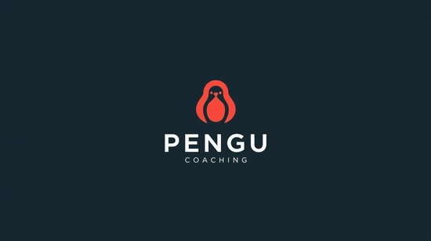

# PenguinX AI 🐧

An AI-powered career guidance and placement preparation platform designed to help students and professionals ace their job interviews and build successful careers.



## 🌟 Features

### Career Guidance
- **AI Career Counselor**: Get personalized career advice from an AI mentor
- **Interactive Chat**: Real-time conversation with context-aware responses
- **Career Path Recommendations**: Discover suitable career paths based on your profile

### Resume Builder & Analyzer
- **AI-Powered Analysis**: Upload your resume for instant AI feedback
- **Improvement Suggestions**: Get actionable tips to enhance your resume
- **ATS Optimization**: Ensure your resume passes Applicant Tracking Systems

### Placement Preparation
- **Coding Practice**: 
  - Multiple difficulty levels (Easy, Medium, Hard)
  - Real-time code execution with test cases
  - AI-powered code evaluation and feedback
  - Support for multiple programming languages

- **Aptitude Tests**:
  - Quantitative reasoning questions
  - Logical reasoning challenges
  - Verbal ability assessments
  - Timed test environment

- **Mock Interviews**:
  - AI-powered interview simulations
  - Real-time feedback on your answers
  - Multiple interview rounds
  - Performance scoring and insights

### User Dashboard
- **Progress Tracking**: Monitor your preparation journey
- **Performance Analytics**: View detailed insights and statistics
- **History**: Access past test results and interview sessions
- **Profile Management**: Customize your learning experience

## 🚀 Tech Stack

- **Frontend**: React 18 + TypeScript
- **Build Tool**: Vite
- **Styling**: Tailwind CSS + shadcn/ui components
- **Backend**: Lovable Cloud (Supabase)
- **Authentication**: Supabase Auth
- **Database**: PostgreSQL (via Supabase)
- **Edge Functions**: Deno serverless functions
- **AI Integration**: Lovable AI Gateway (GPT-5, Gemini 2.5)
- **Routing**: React Router v6
- **State Management**: React Query (TanStack Query)
- **Forms**: React Hook Form + Zod validation

## 📋 Prerequisites

- Node.js (v18 or higher)
- npm or yarn or bun
- Git

## 🛠️ Installation

1. **Clone the repository**
   ```bash
   git clone <YOUR_GIT_URL>
   cd <YOUR_PROJECT_NAME>
   ```

2. **Install dependencies**
   ```bash
   npm install
   ```

3. **Environment Setup**
   
   The project comes with pre-configured environment variables for Lovable Cloud:
   - `VITE_SUPABASE_URL`
   - `VITE_SUPABASE_PUBLISHABLE_KEY`
   - `VITE_SUPABASE_PROJECT_ID`
   
   These are automatically managed by Lovable Cloud.

4. **Start the development server**
   ```bash
   npm run dev
   ```

   The app will be available at `http://localhost:8080`

## 🏗️ Project Structure

```
penguinx-ai/
├── src/
│   ├── components/          # Reusable UI components
│   │   ├── ui/             # shadcn/ui components
│   │   ├── AptitudeTest.tsx
│   │   ├── CodingTest.tsx
│   │   ├── InterviewPractice.tsx
│   │   └── ...
│   ├── pages/              # Page components
│   │   ├── Auth.tsx
│   │   ├── Dashboard.tsx
│   │   ├── CareerGuidance.tsx
│   │   ├── PlacementPrep.tsx
│   │   ├── ResumeBuilder.tsx
│   │   ├── Profile.tsx
│   │   └── Insights.tsx
│   ├── hooks/              # Custom React hooks
│   ├── lib/                # Utility functions
│   ├── integrations/       # Third-party integrations
│   │   └── supabase/       # Supabase client & types
│   ├── App.tsx             # Main app component
│   ├── main.tsx            # App entry point
│   └── index.css           # Global styles & design tokens
├── supabase/
│   ├── functions/          # Edge functions
│   │   ├── analyze-resume/
│   │   ├── career-guidance/
│   │   ├── evaluate-code/
│   │   ├── run-code/
│   │   ├── generate-coding-questions/
│   │   ├── generate-aptitude-test/
│   │   └── interview-practice/
│   └── migrations/         # Database migrations
├── public/                 # Static assets
└── package.json           # Project dependencies
```

## 🎯 Usage

### For Students/Job Seekers

1. **Sign Up/Login**: Create an account to access all features
2. **Complete Your Profile**: Add your details for personalized recommendations
3. **Career Guidance**: Chat with the AI mentor for career advice
4. **Resume Analysis**: Upload your resume for feedback
5. **Practice Coding**: Solve coding challenges and get AI feedback
6. **Take Tests**: Practice aptitude tests to sharpen your skills
7. **Mock Interviews**: Simulate real interview scenarios
8. **Track Progress**: Monitor your improvement over time

### For Developers

1. **Add New Features**: Create components in `src/components/`
2. **Add New Pages**: Create page components in `src/pages/`
3. **Backend Logic**: Add edge functions in `supabase/functions/`
4. **Database Changes**: Use migrations in `supabase/migrations/`
5. **Styling**: Update design tokens in `src/index.css` and `tailwind.config.ts`

## 🔐 Security

- Row Level Security (RLS) policies are enabled on all tables
- User data is isolated and protected
- Authentication handled securely via Supabase Auth
- Environment variables managed securely
- Leaked password protection enabled

## 📊 Database Schema

Key tables:
- `profiles`: User profile information
- `resume_analysis`: Resume analysis results
- `coding_attempts`: Coding test submissions
- `aptitude_test_results`: Aptitude test scores
- `interview_results`: Mock interview evaluations

## 🚢 Deployment

### Deploy to Lovable

1. Click the **Publish** button in the Lovable editor
2. Your app will be deployed to `yourapp.lovable.app`

### Custom Domain

1. Navigate to Project > Settings > Domains
2. Click "Connect Domain"
3. Follow the DNS configuration steps

### Self-Hosting

The code is standard React/Vite and can be deployed to:
- Vercel
- Netlify
- AWS Amplify
- Any static hosting service

## 🤝 Contributing

1. Fork the repository
2. Create a feature branch (`git checkout -b feature/amazing-feature`)
3. Commit your changes (`git commit -m 'Add amazing feature'`)
4. Push to the branch (`git push origin feature/amazing-feature`)
5. Open a Pull Request

## 📝 License

This project is built with [Lovable](https://lovable.dev) and is licensed under the MIT License.

## 🙏 Acknowledgments

- Built with [Lovable](https://lovable.dev)
- UI components from [shadcn/ui](https://ui.shadcn.com)
- Icons from [Lucide](https://lucide.dev)
- Powered by [Lovable Cloud](https://docs.lovable.dev/features/cloud)

## 📞 Support

For questions or support, please:
- Check the [Lovable Documentation](https://docs.lovable.dev)
- Join the [Lovable Discord Community](https://discord.com/channels/1119885301872070706/1280461670979993613)
- Open an issue in this repository

## 🔗 Links

- **Live Demo**: [Your deployed URL]
- **Lovable Project**: https://lovable.dev/projects/276fbcf3-fcc3-487f-9517-ab3d447fa1f3
- **Documentation**: https://docs.lovable.dev

---

